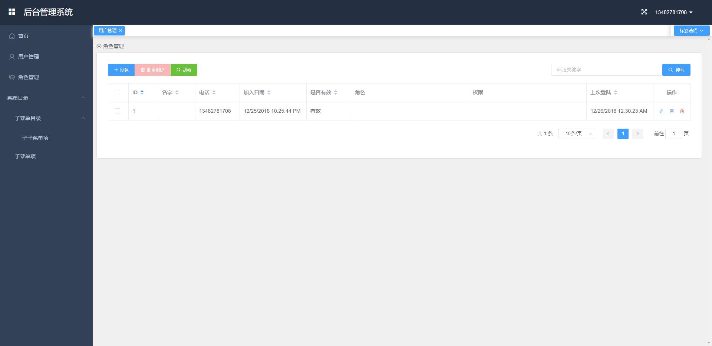

easyauth: 一个快速构建带有登陆和权限验证功能的、基于Django的web项目的工具
==================================================================
不需要任何登陆和权限验证的代码，权限控制全依靠配置实现

.. image:: https://img.shields.io/travis/qingfeng0820/easyauth/master.svg
    :target: https://travis-ci.org/qingfeng0820/easyauth

`README in English <https://github.com/qingfeng0820/easyauth/blob/master/README.rst>`_

许可文件
----------

`BSD License <LICENSE.txt>`_

源代码
--------
`Github <https://github.com/qingfeng0820/easyauth>`_

开发环境
----------
- Python 2.7
- pip
- npm (可以安装nodejs来获取npm)

安装
----

从pypi上安装

.. code-block:: shell

    pip install easyauth

用easyauth构建项目
--------------------

1. 用下面的命令创建项目(将在当前目录下创建项目):
^^^^^^^^^^^^^^^^^^^^^^^^^^^^^^^^^^^^^^^^^^^^^^^^

.. code-block:: shell

    > make_project {项目名字}

2. 配置后端 (基于Django的配置)
^^^^^^^^^^^^^^^^^^^^^^^^^^^^^^

1). 配置easyauth和基于Django的一些配置
    - 如果只是简单测试一下easyauth，可以保持默认配置
    - 主要的配置项都在{项目名字}/settings/production.py
    - {项目名字}/settings/local.py可以配置一些在开发环境测试中需要配置的配置项

2). 在{项目名字}/models.py里面根据自己的项目情况修改User model
    - 看下面的代码例子 (不需要给User model添加serializer, view and permission类)

.. code-block:: python

    from easyauth.models import AbstractUser

    class User(AbstractUser):
        # 你可以定义需要的其他字段
        {Other field} = models.CharField(...)
        # 你可以定义其他某个字段作为USERNAME_FIELD
        # USERNAME_FIELD是区分用户的字段, 用来做登陆使用的
        # 默认值是phone
        USERNAME_FIELD = {Other field to stand for username}

        # 如果用户需要关联一个部门或者公司, 可以指定USER_DEPART_FIELD
        # 如果指定了USER_DEPART_FIELD, 有管理用户的权限的用户只能管理同部门或者公司的用户
        # 默认值是None
        USER_DEPART_FIELD = "company"
        company = models.ForeignKey(Company, related_name='users', null=True)

        # 用来做筛选的Filter属性定义在view类里面
        # 但是User model相关的view都在easyauth里面, 不能被修改
        # 所以在User model里面提供了下面的方式来添加相关的Filter属性
        FILTER_FIELDS = ('company__name', ...)
        SEARCH_FIELDS = (...)
        ORDERING_FIELDS = ('company__name', ...)
        # 如果只是简单测试下easyauth, User model可以没有实现(只需要添加'pass'在这个class里面)

3). 创建项目里面需要的其他models, serializers和views
    - 修改{项目名字}/models.py来添加项目里需要的models

.. code-block:: python

    class DummyModel(models.Model):
        name = models.CharField(max_length=100, unique=True)
        created_time = models.DateTimeField(auto_now_add=True)

        class Meta:
            permissions = (
                ("maintain_dummy_model", _("Can maintain dummy model")),   # <=== 在你的项目model里面定义相应权限
            )
            ordering = ('id', )

- 创建{项目名字}/serializers.py来添加项目里需要的serializers

.. code-block:: python

        from rest_framework import serializers

        from {项目名字} import models

        class DummyModelSerializer(serializers.ModelSerializer):

            class Meta:
                model = models.DummyModel
                fields = '__all__'
                depth = 1

- 创建{项目名字}/permissions.py来添加项目里需要权限检查的相关类

.. code-block:: python

    from easyauth.permissions import DBBasedPermissionsAll

    class DummyModelMaintainPermission(DBBasedPermissionsAll):
        required_permission_names = ["maintain_dummy_model", ]    # <=== 定义项目model相关的权限检查类

- 创建{项目名字}/views.py来添加项目里需要的views

.. code-block:: python

    from rest_framework import viewsets, permissions

    from {项目名字} import models, serializers
    from {项目名字}.permissions import DummyModelMaintainPermission

    class DummyModelViewSet(viewsets.ModelViewSet):
        queryset = models.DummyModel.objects.all()
        serializer_class = serializers.DummyModelSerializer
        permission_classes = (DummyModelMaintainPermission, )                   # <=== 使用前面定义的权限检查类
        # 你也可以使用Rest框架提供的通用权限检查类DjangoModelPermissions
        #  permission_classes = (permissions.DjangoModelPermissions, )

- 修改{项目名字}/urls.py来添加项目里的API urls

.. code-block:: python

    from django.conf.urls import url, include
    from rest_framework import routers

    from easyauth import urls as auth_urls
    from easyauth import admin_urls as user_admin_urls

    from {项目名字} import views

    router = routers.DefaultRouter(trailing_slash=False)
    # app apis
    router.register(r'api/dummy_models', views.DummyModelViewSet, base_name='dummy_model') # <=== 定义项目里面的url

    urlpatterns = router.urls

    urlpatterns += [
        # url(r'^admin/', admin.site.urls),
        # auth apis including login, password reset
        url(r'^api-auth/', include(auth_urls)),            # <=== easyauth提供的登陆相关API
        # user crud apis - only used by administrator
        url(r'^api/', include(user_admin_urls)),           # <=== easyauth提供的user/group/permission管理相关的API
    ]

4). 到{项目名字}目录下去初始化数据库
    - 运行以下命令:

.. code-block:: shell

    项目名字> python manage.py makemigrations
    {项目名字}> python manage.py makemigrations {项目名字}
    {项目名字}> python manage.py migrate

5). 创建超级管理员用户
    - 运行以下命令:

.. code-block:: shell

    {项目名字}> python manage.py createsuperuser

6). 运行后端服务来做开发测试
    - 运行以下命令:

.. code-block:: shell

    {项目名字}> python manage.py runserver 0.0.0.0:80

7). 测试API
    - 测试登陆和权限
        - 用创建的超级管理员用户登陆
        - 创建角色
        - 创建用户，并赋予合适的角色或者权限
    - easyauth提供的所有API
        - 用户角色管理API (超级管理员或有相关权限的用户)
            - /api/groups GET: 获取所有角色 (超级管理员或有'query_group'权限的用户)
            - /api/groups POST: 创建一个角色  (超级管理员用户)
            - /api/groups/[group_id] GET: 获取一个角色  (超级管理员或有'query_group'权限的用户)
            - /api/groups/[group_id] PUT or PATCH: 修改一个角色 (超级管理员用户)
            - /api/groups/[group_id] DELETE: 删除一个角色 (超级管理员用户)
        - 用户管理API (超级管理员或有相关权限的用户, 如果用户model有部门字段, 有权限的用户只能管理一个部门下的所有用户)
            - /api/users GET: 获取所有用户  (超级管理员或者有'query_user'权限的用户)
            - /api/users POST: 创建一个用(超级管理员或者有'create_user'权限的用户)
            - /api/users/[user_id] GET: 获取一个用户   (超级管理员或者有'query_user'权限的用户)
            - /api/users/[user_id] PUT or PATCH: 修改一个用户  (超级管理员或者有'change_user'权限的用户)
            - /api/users/[user_id] DELETE: 删除一个用户  (超级管理员或者有'delete_user'权限的用户)
            - /api/users/[user_id]/reset/password PUT: 重置一个用户的密码 (超级管理员或者有'change_user'权限的用户)
        - 权限查询API (permissions are defined in models code)
            - /api/permissions GET: 获取所有权限 (超级管理员或者有'query_permission'权限的用户)
            - /api/permissions/[permission_id] GET: 获取一个权限 (超级管理员或者有'query_permission'权限的用户)
        - 登陆验证相关API
            - /api-auth/login POST: 用户登陆
            - /api-auth/logout POST (or GET if enabled): 用户登出
            - /api-auth/me PUT or PATCH: 修改当前登陆用户
            - /api-auth/me GET: 获取当前登陆用户
            - /api-auth/password/change PUT: 修改当前登陆用户密码
            - /api-auth/register POST: 用户注册 (这个API可以配置成被禁用)
        - 项目API
            - ...

3. 如何需要管理界面的话, 可以进行前端配置(Vue + Element-UI)
^^^^^^^^^^^^^^^^^^^^^^^^^^^^^^^^^^^^^^^^^^^^^^^^^^^^^^^
1). 到{项目名字}/vue-ui目录下, 运行下面命令下载依赖
    - 运行以下命令:

.. code-block:: shell

    {项目名字}/vue-ui> npm install

2). 在{项目名字}/vue-ui/src/components/config.js里面修改baseURL来配置后端服务地址
    - 看下面的代码例子:

.. code-block:: javascript

    var baseURL = 'http://localhost';                // <=== 生产环境baseURL
    if (process.env.NODE_ENV == 'development') {
        baseURL = 'http://localhost';                // <=== 开发环境baseURL
    }
    ...

3). 在{your_app_name}/vue-ui/build/webpack.base.conf.js里修改alias来切换皮肤
    - 修改alias 'THEME'的值
    - 现在支持两种皮肤
        - resolve('src/themes/default')             // <=== 默认皮肤
        - resolve('src/themes/green')               // <=== 绿色皮肤

4). 创建项目的vue页面到{项目名字}/vue-ui/src/components/page/
    - 公用的页面在{项目名字}/vue-ui/src/components/common/下面

5). 在{项目名字}/vue-ui/src/components/menus.js里面修改左边侧栏的菜单
    - 看下面的代码例子:

.. code-block:: javascript

    import i18n from '../i18n/i18n'
    import permission from './common/permission'
    import Dashboard from '@/components/page/Dashboard'
    import UserAdmin from '@/components/page/UserAdmin'
    import RoleAdmin from '@/components/page/RoleAdmin'     // 角色管理和用户管理页面可以拿来直接用
    import YourSubMenuItem from '@/components/page/YourSubMenuItem'
    import YourSubSubMenuItem from '@/components/page/YourSubSubMenuItem'

    var menu = [
            {
                name: 'Dashboard',
                path: '/dashboard',
                component: Dashboard,
                icon: 'el-icon-lx-home',
                meta: {
                    getTitle: function() {
                        return i18n.t("page.homeTitle")
                    },
                },
            },
            {
                name: 'UserAdmin',
                path: '/userAdmin',
                component: UserAdmin,
                icon: 'el-icon-lx-people',
                meta: {
                    getTitle:  function() {
                        return i18n.t("page.userAdminTitle")
                    },
                    // 必须拥有下面所有定义的权限才能打开这个菜单项
                    requiredPermissions: ['query_group', 'query_permission', 'add_user', 'change_user', 'delete_user'],
                },
            },
            {
                name: 'RoleAdmin',
                path: '/roleAdmin',
                component: RoleAdmin,
                icon: 'el-icon-lx-group',
                meta: {
                        getTitle: function() {
                            return i18n.t("page.roleAdminTitle")
                        },
                        permissionCheck: function(user) {
                            return permission.isSuperUser(user)
                        }
                    },
            },
            {
                name: 'YourFolderMenu',
                icon: 'xxx',
                meta: {
                        getTitle: function() {
                            return "菜单目录"
                        },
                        notRequireAuth: true,                       // <=== 这个配置是表现这个菜单可以被未登录用户访问到
                    },
                subs: [
                      {
                          name: 'YourSubFolderMenu',
                          meta: {
                              getTitle: function() {
                                 return "子菜单目录"
                              },
                              requiredPermissions: [...],
                          },
                          subs: [
                               // 菜单最多有三级
                               {
                                   name: 'YourSubSubMenuItem',
                                   path: '/yourSubSubMenuItem',
                                   component: YourSubSubMenuItem,
                                   meta: {
                                       getTitle: function() {
                                           return "子子菜单项"
                                       },
                                   },
                               },
                               ...

                          ]
                      },
                      {
                          name: 'YourSubMenuItem',
                          path: '/yourSubMenuItem',
                          component: YourSubMenuItem,
                          meta: {
                               getTitle: function() {
                                   return "子菜单项"
                               },
                               requiredPermissions: ['maintain_dummy_model', ...],   // <=== 使用了项目model里面定义的权限
                          },
                      },
                      ...
                ]
            },
    ]

- 菜单效果截图

6). 修改UserAdmin.vue页面
    - 如果有定义字段在项目的User model里, 可以修改UserAdmin.vue页面去支持这些字段
        - 为定义的字段添加列到<el-table>里
        - 为定义的字段添加表单域到编辑用户的<el-dialog>对话框里
        - 修改这个页面里面相应的javascript代码

7). 构建前端页面
    - 运行下面的命令:

.. code-block:: shell

    {项目名字}/vue-ui> npm run build

8). 把构建好的前端拷贝到static目录下
    - 运行以下命令:

.. code-block:: shell

    {项目名字}> mkdir static
    {项目名字}> cp vue-ui/build/* static/

9). 访问前端页面
    - 访问 http://localhost/static/index.html

10). 如果在做前端开发, 可以使用前端开发模式来替代7 - 9步
    - 运行下面的命令, 然后访问 http://localhost:8080来访问页面:

.. code-block:: shell

    {项目名字}/vue-ui> npm run build

更多配置
--------

语言配置
^^^^^^^^
- 切换成中文
    - 在{your app name}/settings/production.py里面修改LANGUAGE_CODE = 'zh-hans'(后端)
    - 在{项目名字}/vue-ui/src/components/config.js里面修改defaultLangCode: "zh-hans"(前端)

.. code-block:: javascript

    ...
    const config = {
        loginFieldName: "phone",                         // <=== 保证这个配置的值和项目User model里面USERNAME_FIELD的值一致
        backendBaseURL: baseURL,
        requestTimeout: 10000,
        defaultLangCode: "zh-hans",                      // <=== 前端语言配置修改这里
    }
    ...

easyauth配置
^^^^^^^^^^^^

如果需要, 在{项目名字}/settings/product.py修改EASYAUTH_CONF:

.. code-block:: python

    EASYAUTH_CONF = {
        'USER_DEFAULT_PWD_MAINTAIN_BY_ADMIN': "12345678",
        'ACCOUNT_LOGOUT_ON_GET': False,
        'DISABLE_REGISTER': False,
        'LANG_PARAM': 'lang',
    }

+----------------------------------------+------------+--------------------------------------------------------------+
|  配置项                                | 配置项类型 | 描述                                                         |
+========================================+============+==============================================================+
| USER_DEFAULT_PWD_MAINTAIN_BY_ADMIN     | string     | 管理员重置用户密码时使用的默认密码.                          |
|                                        |            |                                                              |
|                                        |            | 如果不配置这一项, 默认值是123456                             |
+----------------------------------------+------------+--------------------------------------------------------------+
| ACCOUNT_LOGOUT_ON_GET                  | bool       | 配置logout API是否支持GET请求.                               |
|                                        |            |                                                              |
|                                        |            | 如果不配置这一项, 默认值是False                              |
+----------------------------------------+------------+--------------------------------------------------------------+
| DISABLE_REGISTER                       | bool       | 禁用注册API的配置项                                          |
|                                        |            |                                                              |
|                                        |            | 如果不配置这一项, 默认值是False                              |
+----------------------------------------+------------+--------------------------------------------------------------+
| LANG_PARAM                             | string     | 设置http请求里面的语言参数名字                               |
|                                        |            | (一般不需要修改这个配置项)                                   |
|                                        |            |                                                              |
|                                        |            | 如果不配置这一项, 默认值是lang, 它的使用方式                 |
|                                        |            | http://localhost/api/users?lang=zh-hans                      |
|                                        |            |                                                              |
|                                        |            | 注意: 保证{项目名字}/vue-ui/src/components/common/easyauth.js|
|                                        |            | 里面配置项lang_param的值和这个配置项的值一致.                |
+----------------------------------------+------------+--------------------------------------------------------------+

更多例子请参考本repo里面的test项目

