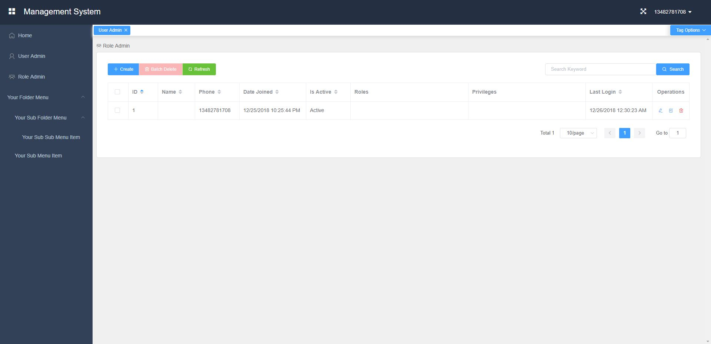

easyauth: A simplified authentication lib based on Django and Rest Framework
===========================================

.. image:: https://img.shields.io/travis/qingfeng0820/easyauth/master.svg
    :target: https://travis-ci.org/qingfeng0820/easyauth

License
-------

`BSD License <LICENSE.txt>`_

Source code
-----------
`Github <https://github.com/qingfeng0820/easyauth>`_

Develop environment
-------------------
- Python 2.7
- pip
- npm (install nodejs)

Installation
--------

from pypi

.. code-block:: shell

    pip install easyauth

Setup your own project via easyauth
-----------------------------------

1. Create your app by below command:
^^^^^^^^^^^^^^^^^^^^^^^^^^^^^^^^^^^^^^^^

.. code-block:: shell

    > make_project {your_app_name}

2. Setup backend which based on django
^^^^^^^^^^^^^^^^^^^^^^^^^^^^^^^^^^^^^^^^

1). Change the django project configuration by {your_app_name}/settings/local.py or {your app name}/settings/production.py
    - You can keep the configuration as default if you just want to trial

2). Change your user mode located in {your_app_name}/models.py
    - see below example code

.. code-block:: python

    from easyauth.models import AbstractUser

    class User(AbstractUser):
        # you can define additional fields for your User Model

        # You can specify the USERNAME_FIELD field.
        # Default is phone
        USERNAME_FIELD = {Other field to stand for username}
        {Other field} = models.CharField(...)

        # You can specify the USER_DEPART_FIELD field if you user model is grouped by department or company
        # In this case, an admin in a company cannot maintain the users in other company
        # Default value is None
        USER_DEPART_FIELD = "company"
        company = models.ForeignKey(Company, related_name='users', null=True)

        # Because the User model related views are defined in easyauth, you cannot create or change filter fields for filtering
        # But you can append the field in this sub user model to filter fields by below properties
        FILTER_FIELDS = ('company__name', ...)
        SEARCH_FIELDS = (...)
        ORDERING_FIELDS = ('company__name', ...)

3). Add your own models, serializers, views
    - modify {your_app_name}/models.py to add your own models
    - create {your_app_name}/serializers.py to add your own serializers
    - create {your_app_name}/views.py to add your own views
    - modify {your_app_name}/urls.py to add your API urls

4). Go to {your_app_name} folder to initiate database
    - run below commands:

.. code-block:: shell

    your_app_name> python manage.py makemigrations
    your_app_name> python manage.py makemigrations {your_app_name}
    your_app_name> python manage.py migrate

5). Then create a superuser
    - run below command:

.. code-block:: shell

    your_app_name> python manage.py createsuperuser

6). Run your django based backend:
    - run below command:

.. code-block:: shell

    your_app_name> python manage.py runserver 0.0.0.0:80

7). Have a test
    - Please use login API to login first
    - Then you can try below restful APIs
        - user group(role) admin APIs (super user or have related permissions)
            - /api/groups GET: Get all user groups (super user or have 'query_group' permission)
            - /api/groups POST: Create an user group  (super user)
            - /api/groups/[group_id] GET: Get an user group  (super user or have 'query_group' permission)
            - /api/groups/[group_id] PUT or PATCH: Modify an user group (super user)
            - /api/groups/[group_id] DELETE: Delete an user group (super user)
        - user admin APIs (super user or have related permissions, if department enabled for user model, user can only maintain users in the same department if he/she has related permissions)
            - /api/users GET: Get all users  (super user or have 'query_user' permission)
            - /api/users POST: Create an user (super user)    (super user or have 'create_user' permission)
            - /api/users/[user_id] GET: Get a specific user   (super user or have 'query_user' permission)
            - /api/users/[user_id] PUT or PATCH: Modify a specific user  (super user or have 'change_user' permission)
            - /api/users/[user_id] DELETE: Delete a specific user   (super user or have 'delete_user' permission)
            - /api/users/[user_id]/reset/password PUT: Reset to default password for a specific user (super user or have 'change_user' permission)
        - query permission API (permissions are defined in models code)
            - /api/permissions GET: Get all permissions (super user or have 'query_permission' permission)
            - /api/permissions/[permission_id] GET: Get a specific permission (super user or have 'query_permission' permission)
        - authentication APIs
            - /api-auth/login POST: User login
            - /api-auth/logout POST (or GET if enabled): User logout
            - /api-auth/me PUT or PATCH: Modify current login user
            - /api-auth/me GET: Get current login user
            - /api-auth/password/change PUT: Change the current login user's password
            - /api-auth/register POST: Register User (This API can be disabled by configuration)
        - Your own APIs
            - ...

3. Setup frontend which based Vue + Element-UI
^^^^^^^^^^^^^^^^^^^^^^^^^^^^^^^^^^^^^^^^^^^^^^
1). Go to {your_app_name}/vue-ui folder, and run below command to install dependency libs
    - run below command:

.. code-block:: shell

    {your_app_name}/vue-ui> npm install

2). Configure your backend baseURL by changing  {your_app_name}/vue-ui/src/components/config.js
    - see below code:

.. code-block:: javascript

    var baseURL = 'http://localhost';                ## <--- baseURL for production
    if (process.env.NODE_ENV == 'development') {
        baseURL = 'http://localhost';                ## <--- baseURL for development
    }
    ...

3). Add your own vue pages to {your_app_name}/vue-ui/src/components/page/
    - Common pages are under {your_app_name}/vue-ui/src/components/common/

4). Change the menu in left slider bar by changing {your_app_name}/vue-ui/src/components/menus.js
    - see below example code:

.. code-block:: javascript

    import i18n from '../i18n/i18n'
    import permission from './common/permission'
    import Dashboard from '@/components/page/Dashboard'
    import HelloWorld from '@/components/HelloWorld'
    import UserAdmin from '@/components/page/UserAdmin'
    import RoleAdmin from '@/components/page/RoleAdmin'     // RoleAdmin and UserAdmin are default pages, you can just use it.
    import YourSubMenuItem from '@/components/page/YourSubMenuItem'
    import YourSubSubMenuItem from '@/components/page/YourSubSubMenuItem'

    var menu = [
            {
                name: 'Dashboard',
                path: '/dashboard',
                component: Dashboard,
                icon: 'el-icon-lx-home',
                meta: {
                    getTitle: function() {
                        return i18n.t("page.homeTitle")
                    },
                },
            },
            {
                name: 'UserAdmin',
                path: '/userAdmin',
                component: UserAdmin,
                icon: 'el-icon-lx-people',
                meta: {
                    getTitle:  function() {
                        return i18n.t("page.userAdminTitle")
                    },
                    // must have all permissions listed above to access this menu item
                    requiredPermissions: ['query_group', 'query_permission', 'add_user', 'change_user', 'delete_user'],
                },
            },
            {
                name: 'RoleAdmin',
                path: '/roleAdmin',
                component: RoleAdmin,
                icon: 'el-icon-lx-group',
                meta: {
                        getTitle: function() {
                            return i18n.t("page.roleAdminTitle")
                        },
                        permissionCheck: function(user) {
                            return permission.isSuperUser(user)
                        }
                    },
            },
            {
                name: 'HelloWorld',
                path: '/helloword',
                component: HelloWorld,
                icon: 'el-icon-lx-emoji',
                meta: {
                        getTitle: function() {
                            return "HelloWorld"
                        },
                    },
            },
            {
                name: 'HelloWorld',
                path: '/helloword',
                component: HelloWorld,
                icon: 'el-icon-lx-emoji',
                meta: {
                        getTitle: function() {
                            return "HelloWorld"
                        },
                    },
            },
            {
                name: 'YourFolderMenu',
                icon: 'xxx',
                meta: {
                        getTitle: function() {
                            return "Your Folder Menu"
                        },
                    },
                subs: [
                      {
                          name: 'YourSubFolderMenu',
                          meta: {
                              getTitle: function() {
                                 return "Your Sub Folder Menu"
                              },
                              requiredPermissions: [...],
                          },
                          subs: [
                               {
                                   name: 'YourSubSubMenuItem',
                                   path: '/yourSubSubMenuItem',
                                   component: YourSubSubMenuItem,
                                   meta: {
                                       getTitle: function() {
                                           return "Your Sub Sub Menu Item"
                                       },
                                   },
                               },
                               ...

                          ]
                      },
                      {
                          name: 'YourSubMenuItem',
                          path: '/yourSubMenuItem',
                          component: YourSubMenuItem,
                          meta: {
                               getTitle: function() {
                                   return "Your Sub Menu Item"
                               },
                               requiredPermissions: [...],
                          },
                      },
                      ...
                ]
            },
    ]

- screenshot for above menu

5). Build you pages
    - run below command:

.. code-block:: shell

    {your_app_name}/vue-ui> npm run build

6). Deploy you pages to static folder
    - run below commands:

.. code-block:: shell

    {your_app_name}> mkdir static
    {your_app_name}> cp vue-ui/build/* static/

7). Access you pages
    - Visit http://localhost/static/index.html

8). if you are focus on pages development, you can use use dev model instead of steps 5 - 7
    - run below command, then visit http://localhost:8080:

.. code-block:: shell

    {your_app_name}/vue-ui> npm run build

More configurations
-------------------

backend Configuration
^^^^^^^^^^^^^^^^^^^^^^^^^^^^^^^^^^^^^^^^

Add EASYAUTH_CONF in {your_app_name}/settings/product.py if you need to do some specific configuration:

.. code-block:: python

    EASYAUTH_CONF = {
        'USER_DEFAULT_PWD_MAINTAIN_BY_ADMIN': "12345678",
        'ACCOUNT_LOGOUT_ON_GET': False,
        'DISABLE_REGISTER': False,
    }

+----------------------------------------+------------+--------------------------------------------------------------+
| Configuration Item                     | Type       | Description                                                  |
+----------------------------------------+------------+--------------------------------------------------------------+
| USER_DEFAULT_PWD_MAINTAIN_BY_ADMIN     | string     | Define the default password for maintaining by administrator.|
|                                        |            | Default value is 123456 for absent                           |
+----------------------------------------+------------+--------------------------------------------------------------+
| ACCOUNT_LOGOUT_ON_GET                  | bool       | Switch for enabling GET method for logout API.               |
|                                        |            | Default value is False for absent                            |
+----------------------------------------+------------+--------------------------------------------------------------+
| DISABLE_REGISTER                       | bool       | Switch for disabling register API.                           |
|                                        |            | Default value is False for absent                            |
+----------------------------------------+------------+--------------------------------------------------------------+

More examples please see the test app in this repo

